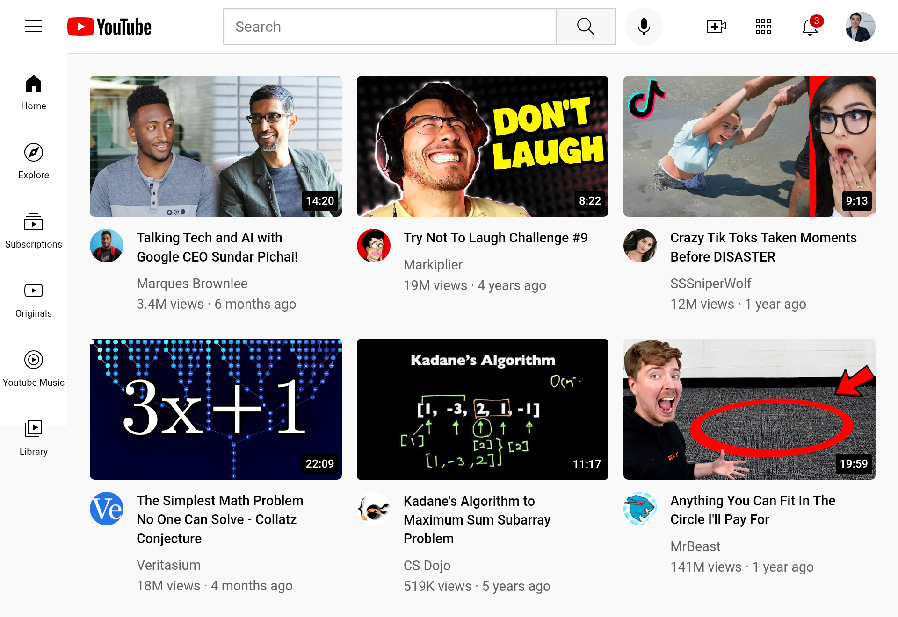

# YouTube Clone 🎥

This is a static YouTube clone built using **HTML**, **CSS**, and **JavaScript**. It replicates the basic layout and structure of YouTube, including video thumbnails, navigation elements, and a search bar.

---

## 🚀 Features

- 🎬 Linked video thumbnails
- 🔍 Static search bar (UI only, not functional)
- 🖥️ Clean and structured layout inspired by YouTube
- 📱 Partially responsive for different screen sizes

---

## 📸 Preview

  

---

## 📁 Project Structure

📂 youtube-clone/
├── 📁 assets/
│   ├── 📁 css/            
│   │   └── style.css
│   ├── 📁 js/             
│   │   └── script.js
│   └── 📁 images/
│       ├── 📁 thumbnails/ 
│       ├── 📁 icons/      
│       └── 📁 channel-logo/ 
│   
│
├── index.html
├── README.md
├── .hintrc (optional)
└── preview.png (for README if needed)
---
## 💡 Notes

- This is a **static frontend project** for design and layout practice.
- The search bar is **not functional** and used only for UI purposes.
- The layout is **partially responsive** and may not display correctly on all mobile screens.

---

## 🛠️ Technologies Used

- HTML5
- CSS3

---

## 📌 To Do

- [ ] Make the layout fully responsive
- [ ] Add real search functionality
- [ ] Improve accessibility and add transitions
- [ ] Refactor CSS for scalability

---

## 📄 License

This project is open-source and available for educational and personal use.

---

## 👨‍💻 Author

**David Adetayo**  
Created as part of frontend development learning and practice.
